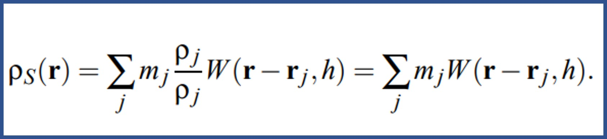
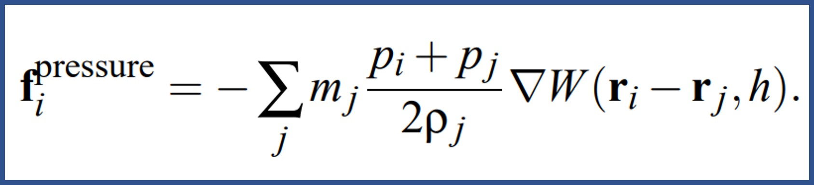
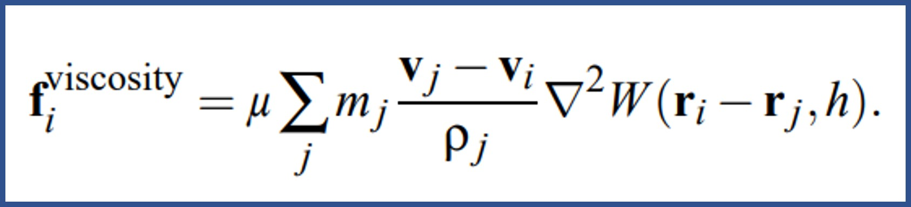
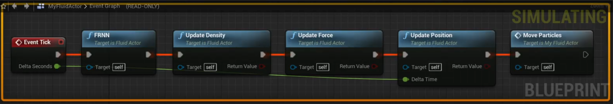
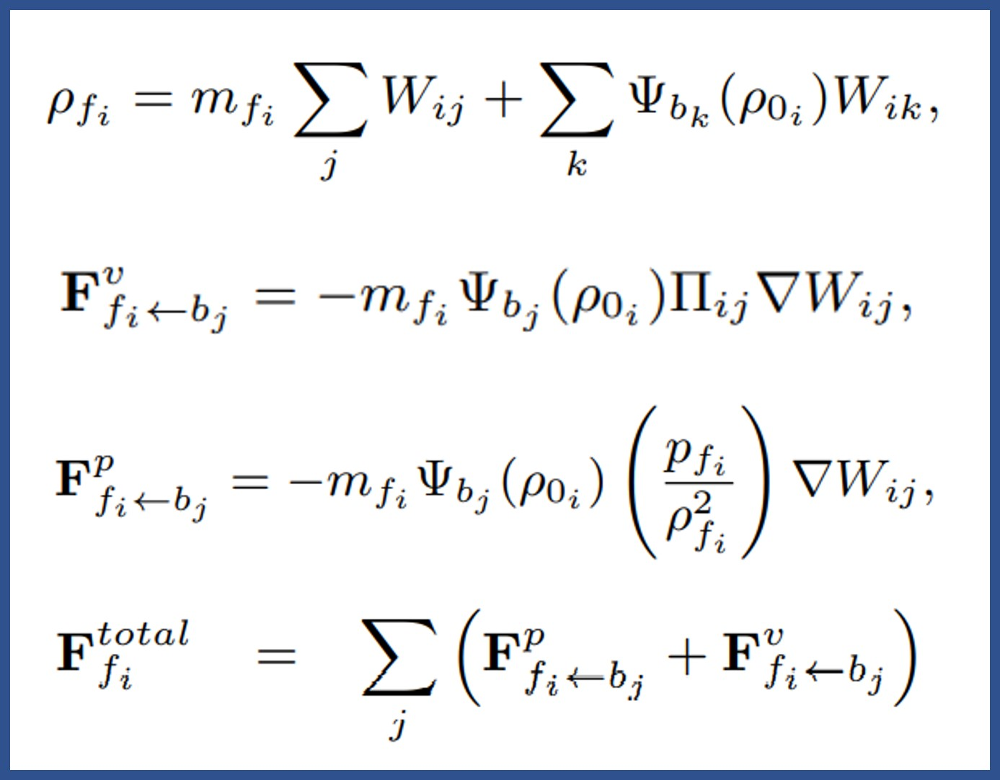
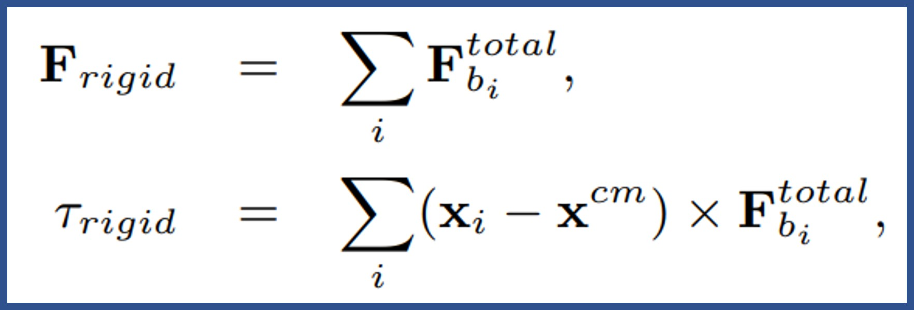
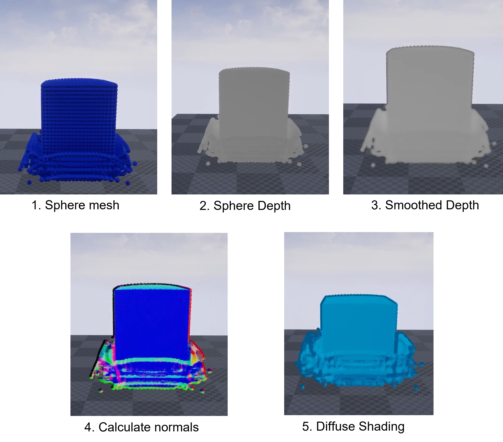

# 2022 Software Capstone Design
소프트웨어융합 201710374 원종서

## requirements
> * CUDA  v11.6
> * UE4  v4.27

## Results
https://www.youtube.com/watch?v=APa0ZF2d3so
    
    

## 
 

## SPH Physics Modelling 
**Navier-Stokes Equations**    
    

**Density:**    
    
    
      
        
**Pressure:**    
    
     
     
       
**Viscosity:**    
    

## SPH Update Routine
    
    
1. Search neighbors by FRNN(Fixed Radius Near Neighbors) algorithm    
2. Compute density
3. Compute forces(pressure, viscosity, gravity)
4. Compute velocity and position form time intergration
5. Update mesh Position

## Rigid-Fluid Coupling
   

## Screen Space Rendering

## References    
* Müller, Matthias, David Charypar, and Markus H. Gross. 
"Particle-based fluid simulation for interactive applications." Symposium on Computer animation. Vol. 2. 2003.

* Akinci, Nadir, et al. 
"Versatile rigid-fluid coupling for incompressible SPH." ACM Transactions on Graphics (TOG) 31.4 (2012): 1-8.

* Ihmsen, Markus, et al. 
"SPH fluids in computer graphics." EUROGRAPHICS 2014/S. LEFEBVRE AND M. SPAGNUOLO. 2014.

* Gissler, Christoph, et al. 
"Interlinked SPH pressure solvers for strong fluid-rigid coupling." ACM Transactions on Graphics (TOG) 38.1 (2019): 1-13.

* van der Laan, Wladimir J., Simon Green, and Miguel Sainz. 
"Screen space fluid rendering with curvature flow." Proceedings of the 2009 symposium on Interactive 3D graphics and games. 2009.

* GREEN S. 
“Screen space fluid rendering for games.” “http://developer.download.nvidia.com/presentations/2010/gdc/Direct3D_Effects.pdf”, 2010.
